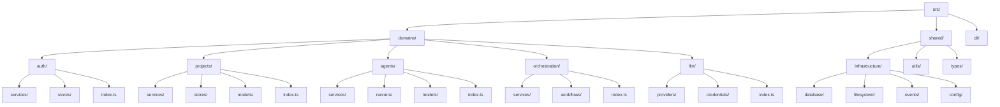
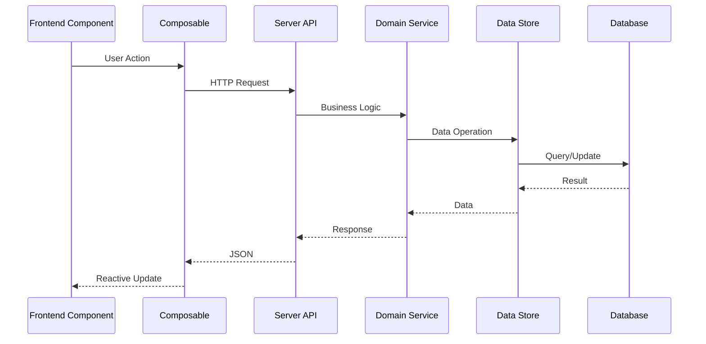
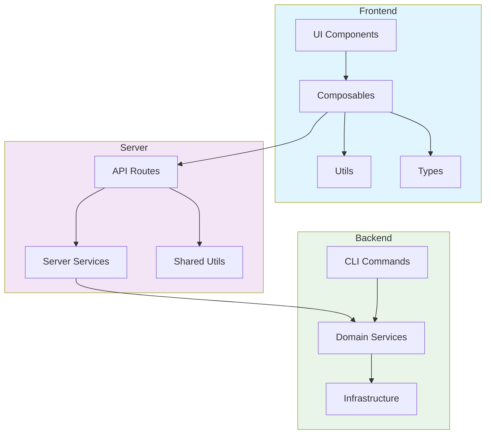
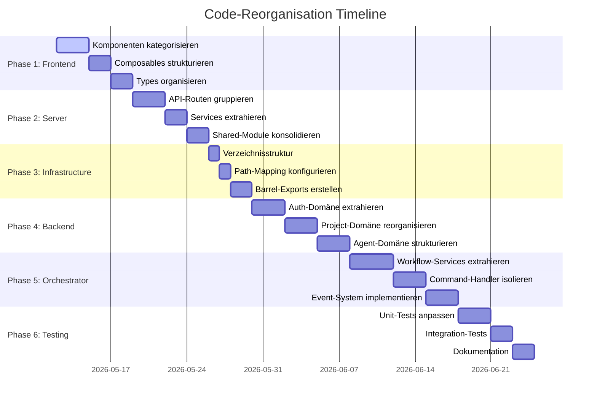
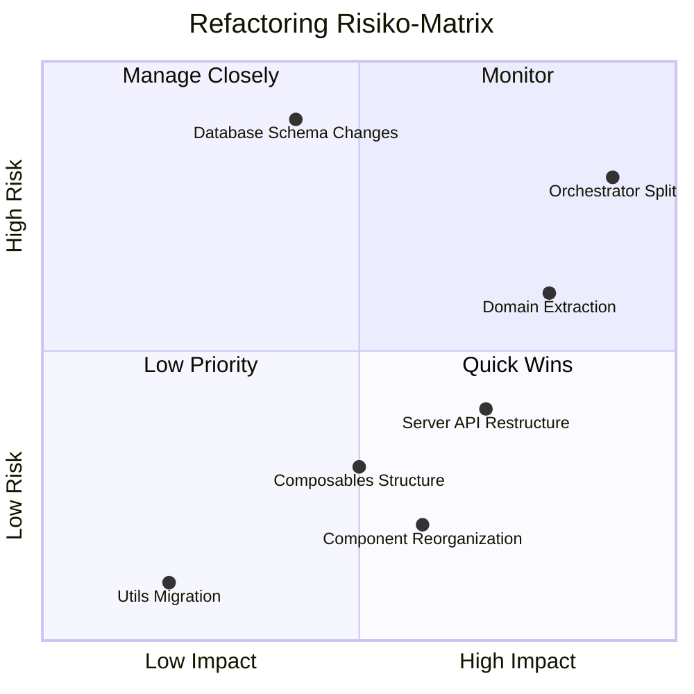
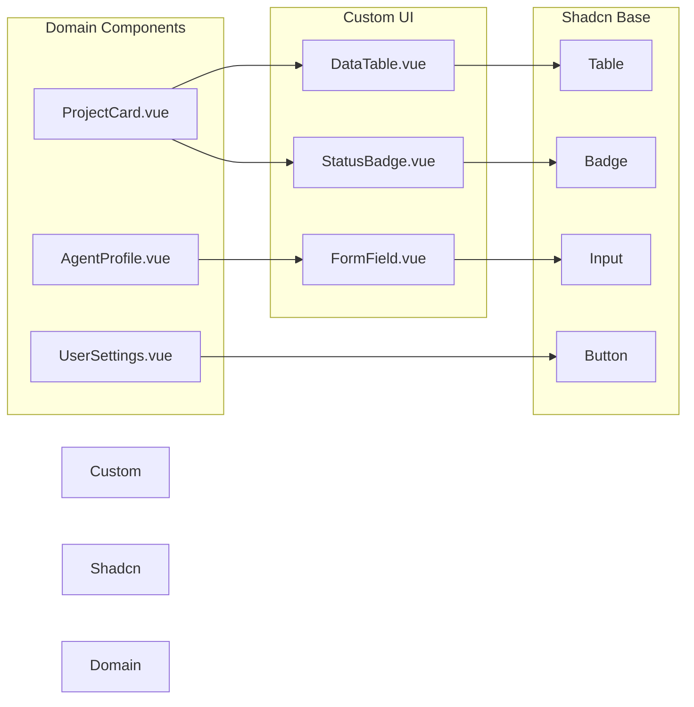

# Architektur-Diagramme für Code-Reorganisation

## Aktuelle vs. Neue Struktur

### Frontend-Architektur (Neue Struktur)

```mermaid
graph TD
    A[app/] --> B[components/]
    A --> C[composables/]
    A --> D[utils/]
    A --> E[types/]
    A --> F[pages/]
    A --> G[layouts/]

    B --> B1[ui/ - Custom Components]
    B --> B2[shadcn/ - Pure shadcn]
    B --> B3[layout/ - Layout Components]
    B --> B4[auth/ - Auth Components]
    B --> B5[projects/ - Project Components]
    B --> B6[agents/ - Agent Components]
    B --> B7[settings/ - Settings Components]
    B --> B8[common/ - Shared Components]

    C --> C1[auth/ - useAuth, useLogin]
    C --> C2[projects/ - useProjects]
    C --> C3[agents/ - useAgents]
    C --> C4[settings/ - useSettings]
    C --> C5[core/ - useApi, useNotifications]

    D --> D1[api.ts]
    D --> D2[validation.ts]
    D --> D3[formatting.ts]
    D --> D4[constants.ts]

    E --> E1[auth.ts]
    E --> E2[projects.ts]
    E --> E3[agents.ts]
    E --> E4[api.ts]
```

### Server-Architektur (Flache Struktur)

```mermaid
graph TD
    A[server/] --> B[auth/]
    A --> C[projects/]
    A --> D[agents/]
    A --> E[admin/]
    A --> F[settings/]
    A --> G[shared/]
    A --> H[plugins/]

    B --> B1[api/ - Auth Routes]
    B --> B2[services/ - Auth Services]
    B --> B3[middleware/ - Auth Middleware]

    C --> C1[api/ - Project Routes]
    C --> C2[services/ - Project Services]

    D --> D1[api/ - Agent Routes]
    D --> D2[services/ - Agent Services]

    E --> E1[api/ - Admin Routes]
    E --> E2[services/ - Admin Services]

    F --> F1[api/ - Settings Routes]
    F --> F2[services/ - Settings Services]

    G --> G1[database/ - DB Client & Schema]
    G --> G2[validation/ - Validation Utils]
    G --> G3[middleware/ - Shared Middleware]
    G --> G4[utils/ - Server Utils]
```

### Backend Core-Architektur (Domain-Driven)

## Datenfluss-Diagramm

## Abhängigkeits-Diagramm

## Migration-Phasen

## Risiko-Matrix

## Komponenten-Abhängigkeiten

